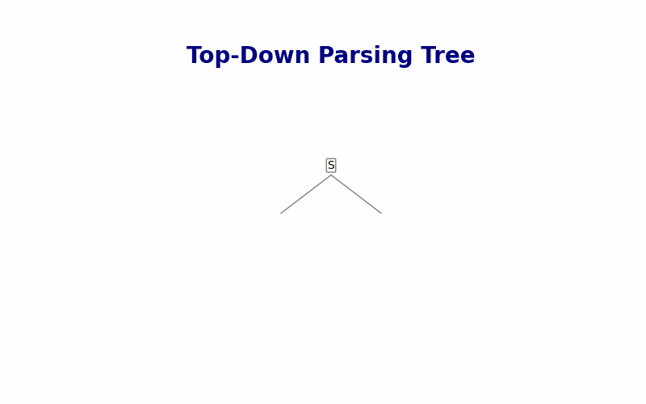

# Top-Down Parser for Context-Free Grammars

## Description

This Python script implements a **Top-Down Parser** for analyzing and parsing strings based on a context-free grammar. The parser uses **recursive descent parsing** and checks whether the input string is accepted based on the provided grammar. The program also checks if the grammar is simple, meaning it doesn't have left recursion or ambiguity.

## Features

- **Grammar Definition**: Define grammar using non-terminals and production rules.
- **Simple Grammar Validation**: Ensures grammar is simple (no left recursion or ambiguity).
- **String Parsing**: Verifies input string validity using the provided grammar.
- **Error Detection**: Identifies issues with grammar or rejected strings.
- **Visualize Parse Tree**: Outputs an animated parse tree visualization.
- **Interactive Grammar Editing**: Modify rules during parsing.
- **User-Friendly Interface**: Interactive inputs for grammar and strings.

## Usage

1. Run the script in a Python environment.
2. Input grammar rules by specifying non-terminals and their counts.
3. Check grammar simplicity.
4. Parse input strings to verify acceptance.
5. Edit grammar or parse additional strings interactively.
6. View animated parse tree (saved as `tree.gif`).

## Example

### Input

```plaintext
PS D:\> python main.py

======================================================================================================================================================
                                                        Top-Down Parser Setup 🆓
======================================================================================================================================================

=> Enter non-terminals and their rule count (e.g., S,2 & B,2): S,2 & B,2
         - Enter rule 1 for 'S': aSB
         - Enter rule 2 for 'S': a
         - Enter rule 1 for 'B': a
         - Enter rule 2 for 'B': bBa
----------------------------------------------------------------------------------------------------
                Grammar Successfully Added!✅
 ____________________________________________________________________________________________________
 1. S -> aSB, a
 2. B -> a, bBa
__________________________________________________
        Enter a string to parse: aba

__________________________________________________
The input String: ['a', 'b', 'a']
Stack after checking: []

----------------------------------------
         The string 'aba' is ACCEPTED.✅✅✅
----------------------------------------

 The parse tree is saved as 'tree.gif' in the current directory.✅
(Include animated tree image here)[image.png]
```

### Output

```plaintext
----------------------------------------
         The string 'aba' is ACCEPTED.✅✅✅
----------------------------------------
Parse Tree Visualization:
[Animated parse tree showing step-by-step parsing.]
```

### Error Example

```plaintext
----------------------------------------
         The string 'abb' is REJECTED.❌❌❌
----------------------------------------
Remaining Input: ['b']
Current Stack: []
```

## Visualization of Parse Tree

**Parse Tree for The input String: ['a', 'b', 'a']:** 

**Parse Tree for The input String: ['a', 'b', 'b', 'a']:** 

## Team Members

- **[Eng/ Ahmed Hesham]** - Supervisor | Compiler Design Assistant Lecturer
- **Ahmed Hussien El Sayed** - Project Lead | Developer | Documentation Specialist
- **Ahmed Ebrahim El Sayed** - Developer | Tester

## License

This project is licensed under the MIT License - see the [LICENSE](LICENSE) file for details.

## Acknowledgments

- Inspired by educational projects on context-free grammar parsing.
- Special thanks to Eng / Ahmed Hesham for explanation and support.
- Special thanks to the Python community for resources and guidance.
